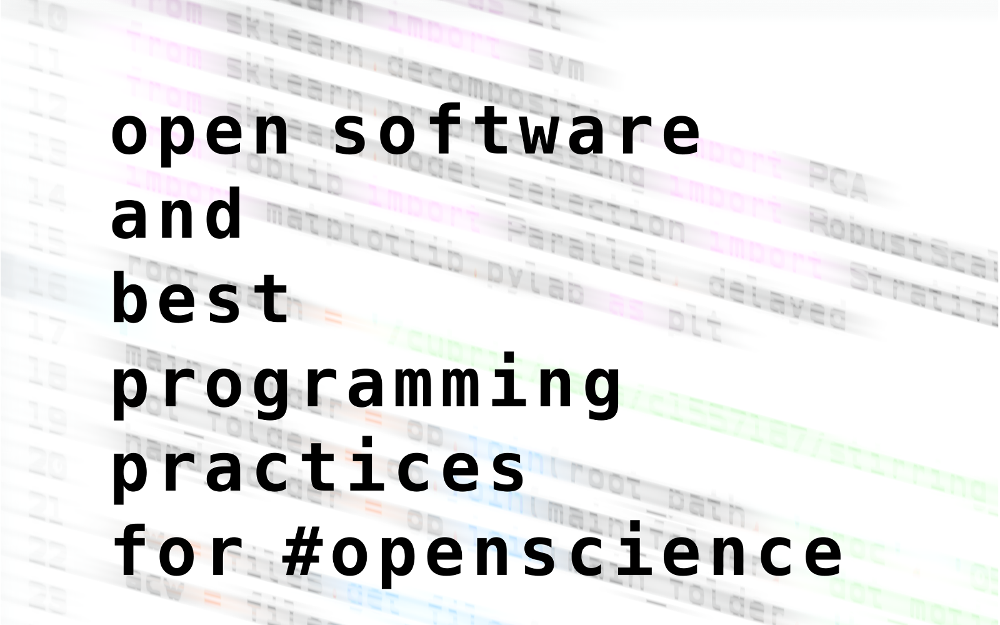
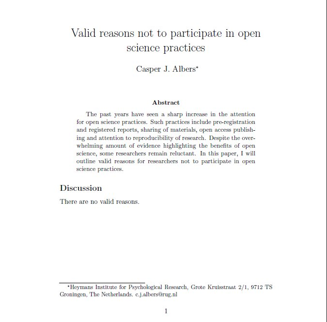

  

<b>Maciej Szul</b>

 <h3>BEST PROGRAMMING PRACTICES FOR OPEN SCIENCE (25 MAY, CUBRIC)</h3> 

GW4 funded (yay!) workshop targets all students who use programming languages in their daily work (statistical analysis, numerical simulations, data processing, statistical modelling, experimental procedures). Experts and competent tutors will demonstrate practical solutions on how to make scientific code more accessible to other potential users and how to improve reproducibility of the results. The workshop will address new developments in programming workflow that can be applied across disciplines.

Main topics: best porgramming practices, code sharing, collaboration, scientific writing, reference managing data sharing, reproducibility. (coffee and food)

https://sciprogramming.wordpress.com/

 <h3>Survey on knowledge and adoption of open research practises in the School of Psychology</h3>

* 36% response rate among PGRs
* 96.8% - open data is important
* 93.3% - open digital materials/code is important
* 54.8% - lack of information or training is a barrier
* 45.2% - lack of supporting infrastructure is a barrier
* 45.2% - lack of time is a barrier

  

 <h3>OUTLINE:</h3> 

* why should you care about open science?
* why should you care about using open software?
* how good programming practices can help you?

 <h3>Why should you care about open science?</h3> 

* reliability
* reproducibility
* transparency
* longer pre-, post- print life of your work (peer review, data)
* facilitates collaboration
* you can change the future
* can reduce a 'file drawer problem'
* signals values (good for ECRs)
* has better citation rate (https://doi.org/10.1371/journal.pone.0000308)
* looks better on CV

 <h3>Why should you care about using open software?</h3> 

* **Three kinds of reproduction**: analysis, data generating procedures, results (http://goo.gl/Fj5aHb)
* 'When in doubt make it public.' - Jeff Atwood (co creator of Stack Overflow)
* Helps the standarisation of the field
* Very likely to be free and widely available
* More eyeballs
* More ethical/transparent

 <h3>How good programming practices can help you?</h3> 

* saves you time!
* takes very little to improve your code
* new useful skills
* version control
* more confidence in sharing the code
* transferable skills

  

Presentation is available on GitHub: https://github.com/maciekszul/open_software_open_science

 <h3>OTHER SOURCES:</h3> 

* http://sciencecodemanifesto.org/
* http://loci.wisc.edu/software/oss
* http://www.nature.com/news/2010/101013/full/467753a.html
* https://pantonprinciples.org/
* http://journals.plos.org/ploscompbiol/article?id=10.1371/journal.pcbi.1002802
